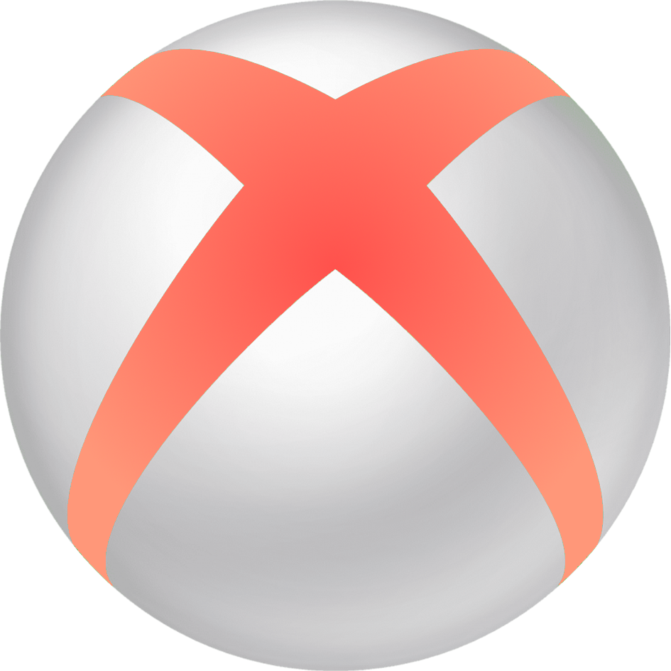

    
    <h1>XBOP</h1>
    <h3>Play various minigames on Discord</h3>
    <a href="https://discord.com/oauth2/authorize?client_id=796457702666534972&permissions=3136&redirect_uri=https%3A%2F%2Fbecauseofprog.fr&response_type=code&scope=bot%20applications.commands%20applications.commands.update">Invite</a> - <a href="https://becauseofprog.fr">Website</a> - <a href="https://discord.becauseofprog.fr">Discord server</a> - <a href="./LICENSE">License</a>

## 🚀 Invite the bot

**⚠ For the moment, the bot isn't online, and only french is available. _onk onk baguette_**

Use our bot on your server using this [awesome link](https://discord.com/oauth2/authorize?client_id=796457702666534972&permissions=3136&redirect_uri=https%3A%2F%2Fbecauseofprog.fr&response_type=code&scope=bot%20applications.commands%20applications.commands.update)! *no paid features I swear*

To get started, type `!help` and see the list of commands. Try playing some games such as tic-tac-toe -amazing- or hangman -wholesome!-.

## 🌈 Features

TODO

## 💻 Development

TODO

## 📜 Credits

- Libraries: [discordgo](https://github.com/bwmarrin/discordgo), [onyxcord](https://github.com/theovidal/onyxcord)
- Maintainer: [Théo Vidal](https://github.com/theovidal)

## 🔐 License

[GNU GPL v3]
